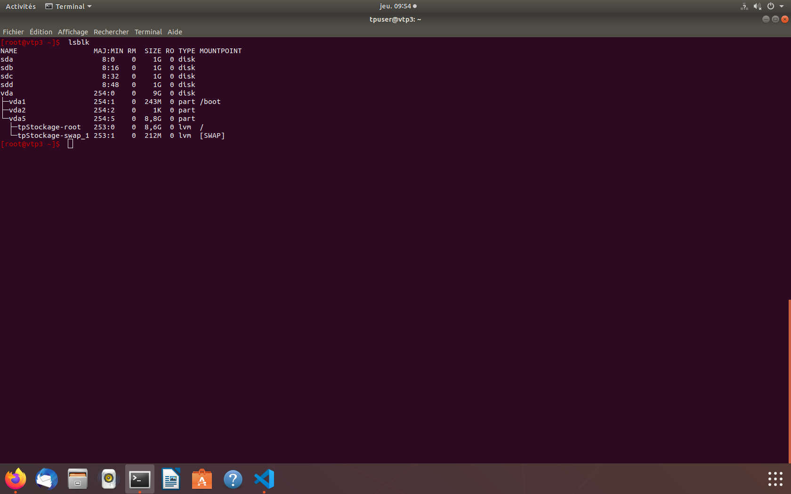
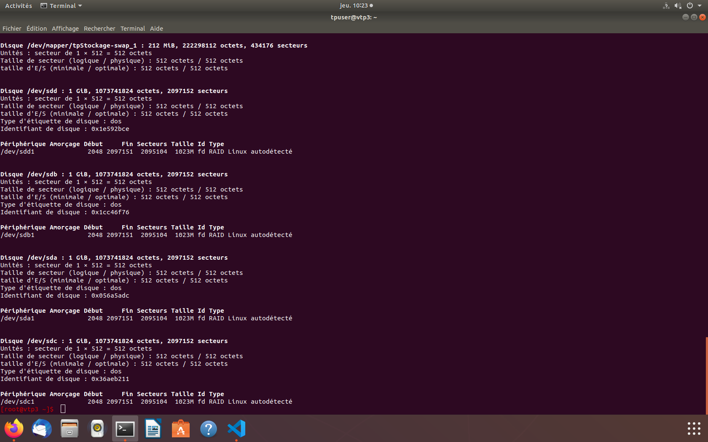
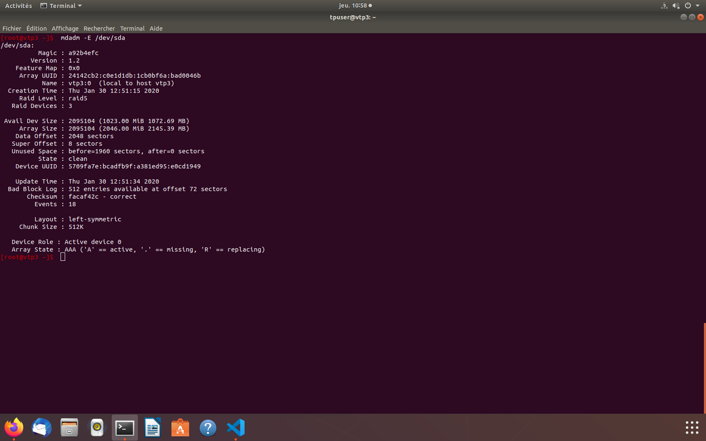
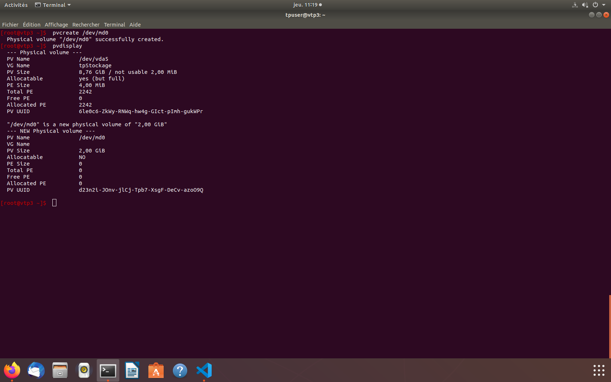
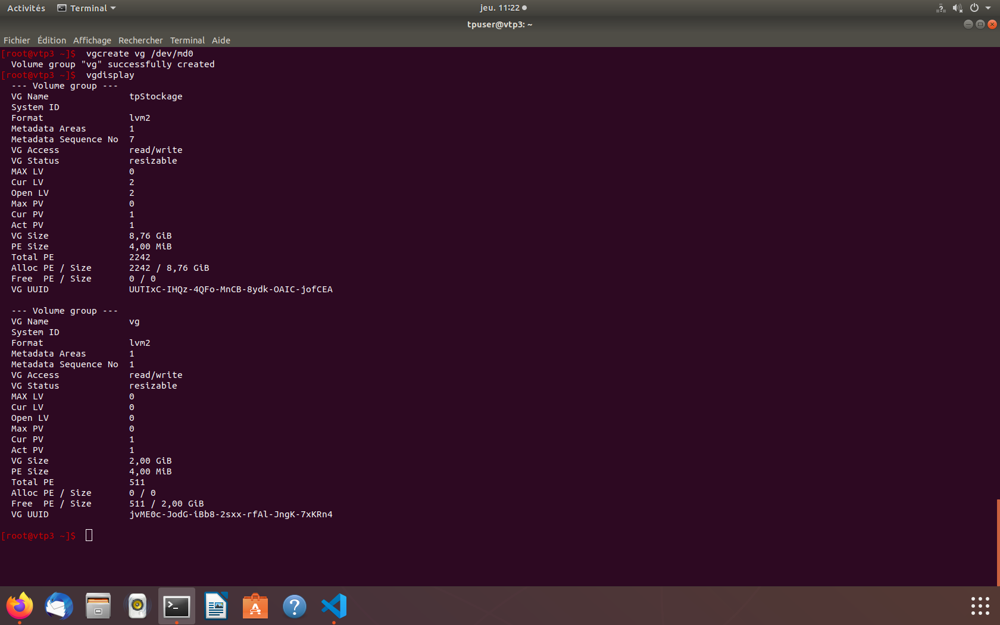
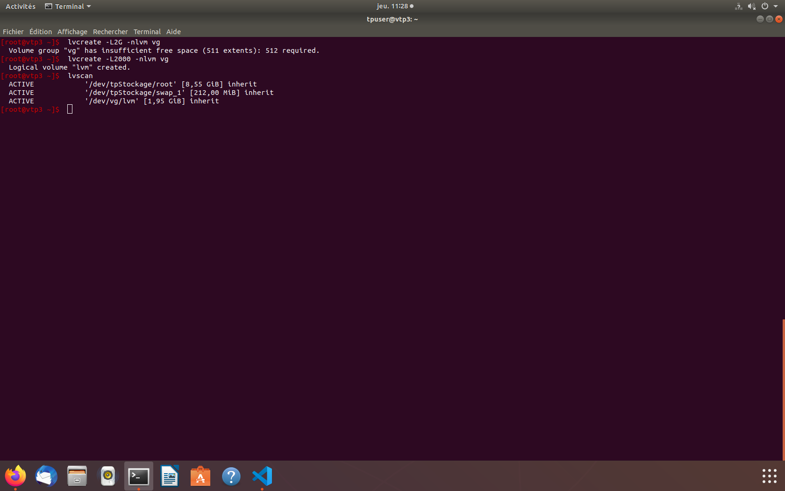
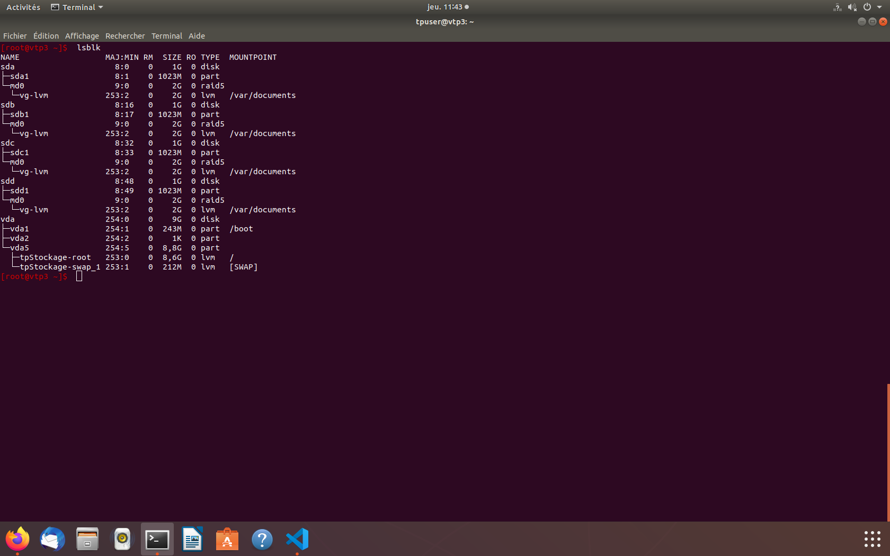

# Réseaux et Stockages Distribués - TP02

## Configuration

Afin de pouvoir accéder à la machine virutelle distante, il faut d'abord y établir une route. Pour cela on change le gateway par défaut à celui fournit (`10.192.12.1`) puis on définit la route de la machine virtuelle depuis le gateway. Pour cela on utilise les commandes suivantes sur la machine locale:

```bash
sudo route add -host 10.192.12.1 dev eno1
sudo route add -net 192.168.201.0/24 gw 10.192.12.1
```

Une fois connecté, on peut changer d'utilisateur (root) en utilisant la commande suivante. Toutes les commandes qui sont listées dans ce rapport seront exécutées sous cet utilisateur.

```bash
su - root
```

## Configuration des disques en **RAID**

1. Observez la configuration de votre machine distante puis créez 1 partition sur chacun des disques inutilisés (hors système d'exploitation) de type # Linux raid autodetect #.

Pour observer la configuration de la machine virtuelle on va utiliser les commande `fdsik` et `lsblk`. On obtient donc les résultats suivants sur la machine distante:



On observe donc 5 disques différents dont 4 vierges (de sda à sdd) et un disque vda qui contient le système d'exploitation de la machine virtuelle. On va donc créer des partitions sur les disques */dev/sda* */dev/sdb* */dev/sdc* */dev/sdd*.

Pour cela on utilise la commande `fdsik` comme suit:

```bash
fdsik /dev/sda # on sélectionne le disque sur lequel on veut travailler
d # on supprime les partitions existantes
n # on créé une nouvelle partion (on laisse toutes les valeurs par défaut)
t # on change l'identifiant de 83 à fd
w # on écrit les changements sur le disque
```

On utilise le meme procédé pour les autres disques et on obtient le résultat suivant (on utilise la commande `fdisk -l`):



2. À l’aide du cours, du fabuleux manuel et de la commande `mdadm` créez un système **RAID5** avec les partitions créées précédemment en réservant une partition pour le *spare*.

Pour créer le système **RAID5** on utilise la commande suivante:

```bash
mdadm --create /dev/md0 --level=5 --raid-device=3 /dev/sda /dev/sdb /dev/sdc --spare=1 /dev/sdd
```

Ici on n'utilise que 3 disques afin de réserver */dev/sdd* en tant que spare. On spécifie le nombre de disques à utiliser avec `--raid-device=3` et la version de **RAID** avec `--level=5`. 

On définit le disque *spare* avec l'option `--spare=1 /dev/sdd`

On obtient les résultats suivant:



On observe donc bien que nos disques sont configurés pour fonctionner avec **RAID5**, les trois premiers utilisés de manière standard et le */dev/sdd* est utilisé en tant que *spare*.

## Configuration des volumes

1. Initialisez le volume que vous venez de créer pour pouvoir l'utiliser avec LVM.

Pour créer le volume physique, on utilise la meme commande que dans le premier TP, à savoir `pvcreate`:

```bash
pvcreate /dev/md0
```

On utilise ensuite `pvdisplay` afin d'obtenir les résultats suivant qui confirme la création de notre nouveau volume physique:



2. Créez un groupe de volumes contenant le volume. Vérifiez.

Pour créer le groupe de volumes on utilise la commande suivante:

```bash
vgcreate vg /dev/md0
```

On obtient le résultat suivant avec la commande `vgdisplay`:



3. Créez un volume logique utilisant la totalité des extends du groupe.

On créé un volume logique qui englobe la totalité de l'espace disponible avec la commande suivante:

```bash
lvcreate -nlvm vg
```

On peut ensuite observer le résultat avec la commande `lvscan`:



On utilise la totalité de l'espace disponible afin de créer un espace commun pour trois futurs utilisateurs, **bill**, **linus** et **tim**.

## Création des systèmes de fichiers

1. Créez un système de fichier ext4 dans le volume précédement créé.

Pour créer un système de fichier en **ext4** dans le volume *lvm* précédement créé, on utilise la commande `mkfs` comme suit:

```bash
mkfs -t ext4 /dev/vg/lvm
```

2. Montez le système de fichiers dans */var/documents* et créez les utilisateurs dans le groupe *travailleurs* (`mount` et `adduser`...).

D'abord on créé le dossier */var/documents*, puis on monte le volume sur ce dossier.

```bash
mkdir -p /var/documents
mount /dev/vg/lvm /var/documents
```
https://www.webmaster-hub.com/topic/3441-saut-de-page-en-html/
Ensuite on créé les utilisateurs qui appartiennent au groupe *travailleurs*:

```bash
# on créé les utilisateurs avec leurs mot de passe
# on utilise l'option -M afin de ne pas créer de dossier home (on leur attribue plus tard)
useradd -M bill -p bill
useradd -M linus -p linus
useradd -M tim -p tim
groupadd travailleurs # on créé le groupe travailleurs
# on ajoute les utilisateurs créés précédement dans le groupe travailleurs
usermod -a -G travailleurs bill 
usermod -a -G travailleurs linus 
usermod -a -G travailleurs tim 
```

3. Vérifiez avec la commande `lsblk` que votre configuration est correcte.

On obtient les résultats suivants en utilisant la command `lsblk`:



4. Créer les répertoires:
    - /var/documents/projetAvion
    - /var/documents/projetBateau
    - /var/documents/projetCamion

On utilise la commande `mdkir`:

```bash
mkdir -p /var/documents/projetAvion
mkdir -p /var/documents/projetBateau
mkdir -p /var/documents/projetCamion
```

## Gestion d'accès aux documents

1. Contraintes:
- Bill doit avoir accès en lecture seule aux documents de tout les projets
- Linus doit avoir accès en lecture/écriture sur le projet Avion, en lecture seule sur le projet Bateau et aucun droits sur le projet Camion
- Tim doit avoir accès en lecture/écriture sur le projet Camion, en lecture seule sur le projet Bateau, et aucun droits sur le projet avion

Pour attribuer les droit décrits ci-dessus on va utiliser la commande `setfacl`.

```bash
# on définit les règles de l'utilisateur bill 
setfacl -Rm u:bill:r /var/documents
setfacl -Rm d:u:bill:r /var/documents # règle par défaut utilisées lors de la création de futurs dossiers/fichiers

# on définit les règles de l'utilisateur linus
setfacl -Rm u:linus:rw /var/documents/projetAvion # lecture/écriture 
setfacl -Rm d:u:linus:rw /var/documents/projetAvion # règle par défaut
setfacl -Rm u:linus:r /var/documents/projetBateau # lecture
setfacl -Rm d:u:linus:r /var/documents/projetBateau # règle par défaut

# on définit les règles de l'utilisateur tim
setfacl -Rm u:tim:rw /var/documents/projetCamion # lecture/écriture 
setfacl -Rm d:u:tim:rw /var/documents/projetCamion # règle par défaut
setfacl -Rm u:tim:r /var/documents/projetBateau # lecture
setfacl -Rm d:u:tim:r /var/documents/projetBateau # règle par défaut
```

On obtient les résultats suivants avec la commande `getfacl *`:

```bash
# file: projetAvion
# owner: root
# group: root
user::rwx
user:bill:r--
user:linus:rw-
group::r-x
mask::rwx
other::r-x
default:user::rwx
default:user:bill:r-- # bill en lecture seule par défaut
default:user:linus:rw- # linus en lecture/écriture par défaut
default:group::r-x
default:mask::rwx
default:other::r-x

# file: projetBateau
# owner: root
# group: root
user::rwx
user:bill:r--
user:linus:r--
user:tim:r--
group::r-x
mask::r-x
other::r-x
default:user::rwx
default:user:bill:r-- # bill en lecture seule par défaut
default:user:linus:r-- # linus en lecture seule par défaut
default:user:tim:r-- # tim en lecture seule par défaut
default:group::r-x
default:mask::r-x
default:other::r-x

# file: projetCamion
# owner: root
# group: root
user::rwx
user:bill:r--
user:tim:rw-
group::r-x
mask::rwx
other::r-x
default:user::rwx
default:user:bill:r-- # bill en lecture seule par défaut
default:user:tim:rw- # tim en lecture/ecriture par défaut
default:group::r-x
default:mask::rwx
default:other::r-x
```

## Chiffrement d'une partition

1. Demmandez à l'enseigant de regénérer votre machine distante.
2. Créer une partition de taille quelconque sur un disque.

Pour cela on utilise la commande `fdisk /dev/sda` et on créé une nouvelle partition.

3. Utilisez cryptsetup pour créer un volume chiffré sur celle-ci puis pour l’ouvrir.

Afin de créer le volume chiffré on utilise cryptsetup comme suit:

```bash
cryptsetup create crypted /dev/sda
cryptsetup open crypted
```